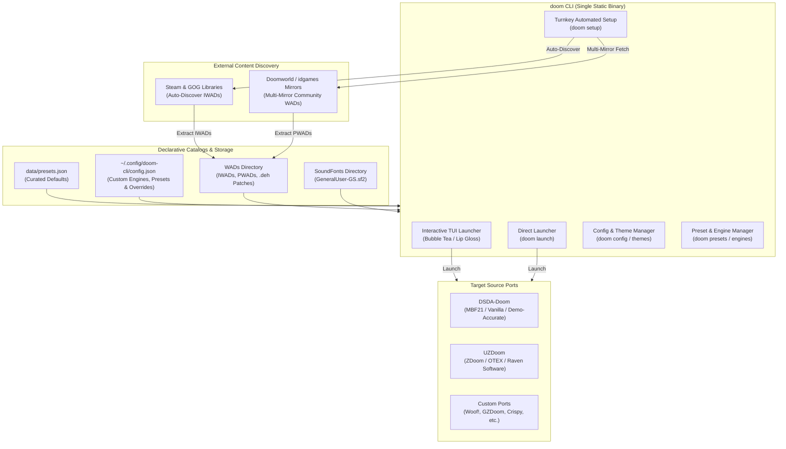

# Contributing to doom-cli

Thank you for your interest in contributing to `github.com/lock14/doom-cli`! This document outlines our
repository standards, architectural guidelines, modular package layout, development workflow, testing requirements,
and pull request conventions.

---

## 1. Repository Design Principles

All contributions must respect our core foundational principles:

*   **Declarative Presets & Single Source of Truth**: All preset definitions, source port engine assignments,
    IWAD mappings, PWAD file lists, DeHackEd orderings, metadata, and download URLs are defined declaratively in
    [`data/presets.json`](data/presets.json). Use `doom presets build` to synchronize them with `README.md`.
*   **Portability & Path Invariants**:
    *   **Never commit personal user paths, display resolutions, or refresh rates**: Do not commit paths like
        `/home/<user>/`, hardcoded display resolutions, or fixed monitor refresh rates into configurations, presets,
        or code.
    *   **Use Placeholder Tokens**: Use `__HOME__`, `__RESOLUTION__`, `__REFRESH_RATE__`, and `__SOUNDFONT__` in
        configuration templates and presets. The CLI deployment tooling dynamically substitutes these based on
        runtime display and filesystem detection.
    *   **Standard Directory Structures**: Respect platform standard directories (XDG on Linux,
        `~/Library/Application Support/` on macOS, and `%LOCALAPPDATA%`/`%APPDATA%` on Windows).
*   **Destructive Safety & Backup Policy**: Any deployment target or command (`doom config install`, `doom setup`)
    must generate timestamped backups (`.bak.<timestamp>`) before overwriting or modifying any existing user
    configuration file.
*   **Archive Security & Zip Slip Hardening**: All archive extractions (`archive/zip`) must sanitize entry paths
    against `..` traversal sequences and verify
    `strings.HasPrefix(cleanDest, cleanTargetDir + string(filepath.Separator))` before any filesystem write.
*   **Doom Engine Selection & Preset Hygiene**:
    *   **DSDA-Doom**: Use for classic vanilla, Boom, MBF, and MBF21 maps where demo accuracy, standard physics,
        and speedrunning precision are desired (e.g., *Alien Vendetta*, *BTSX*, *Sunder*, *Sunlust*, *Legacy of Rust*,
        *Sigil*).
    *   **UZDoom**: Use for mapsets requiring ZDoom/GZDoom scripting, high-res texture packs like OTEX
        (*Eviternity I & II*), or Raven Software games (*Heretic*, *Hexen*).
    *   **No Duplicate IWADs**: Never include the base game IWAD in PWAD/mappack lists. The IWAD must only be
        specified in `iwad`.
    *   **Filename Normalization & Alias Tolerance**: Maintain case-insensitive and dash/underscore/space-tolerant
        file resolution so maps and DeHackEd patches resolve reliably regardless of user file naming.
    *   **Layered Catalogs**: Curated defaults in `data/presets.json` are immutable; user additions layer cleanly
        through `~/.config/doom-cli/config.json`.

---

## 2. Architecture & Modular Package Layout



The repository features a unified, zero-dependency Go CLI (`doom`) that compiles to a single static binary:

```
doom-configs/
├── cmd/doom/               # Command-line interface definitions using Cobra
│   ├── main.go             # Entrypoint, root command, global flags, path helpers
│   ├── play.go             # 'doom play' interactive launcher with Bubble Tea
│   ├── launch.go           # 'doom launch' direct preset execution command
│   ├── setup.go            # 'doom setup' turnkey installation workflow
│   ├── wads.go             # 'doom wads' subcommands (list, fetch, extract-steam)
│   ├── engines.go          # 'doom engines' subcommands (list, add, remove, install)
│   ├── presets.go          # 'doom presets' subcommands (list, show, add, config, remove, build)
│   ├── soundfont.go        # 'doom soundfont install' subcommand
│   ├── config.go           # 'doom config' subcommands (show, get, set, toggle, install, diff, sync)
│   └── themes.go           # 'doom themes' subcommands (list, set)
├── internal/
│   ├── config/             # Cross-platform path resolution and user configuration (config.json)
│   ├── display/            # Native display resolution and refresh rate auto-detection
│   ├── engine/             # Source port runners, execution argument synthesis, portable binary installers
│   │   ├── runner.go       # Synthesizes arguments and executes engine processes
│   │   └── installer.go    # Downloads and extracts portable engine binaries (Zip Slip hardened)
│   ├── preset/             # Catalog management, file resolution, text decoding, README synchronization
│   │   ├── preset.go       # Catalog data models, catalog layering, and embedded presets loader
│   │   ├── resolve.go      # Case-insensitive, whitespace-tolerant file resolution with aliases
│   │   ├── decode.go       # Robust text decoding with CP437/DOS box-drawing character detection
│   │   └── compiler.go     # Synchronizes presets catalog table into README.md
│   ├── steam/              # Steam/GOG library discovery (libraryfolders.vdf) and game file extraction
│   ├── templates/          # Embedded engine configuration templates and backup deployer
│   ├── tui/                # Terminal user interface components powered by Bubble Tea and Lip Gloss
│   │   ├── launcher.go     # Bubble Tea state machine, update loop, and message routing
│   │   ├── layout.go       # Dynamic viewport and responsive pane geometry calculations
│   │   ├── render.go       # Split-pane UI rendering, badges, status lines, and key help formatting
│   │   ├── menu.go         # Fallback numbered terminal menu for basic or non-TTY environments
│   │   ├── theme.go        # Theme loading, custom JSON theme decoding, and ANSI/TrueColor styles
│   │   └── builtin_themes.go # Curated color palettes adhering to the 60-30-10 design principle
│   └── wad/                # WAD downloading, archive extraction, and SoundFont deployment
│       ├── downloader.go   # Multi-mirror downloader for community megawads from idgames
│       ├── extract.go      # Zip Slip hardened archive extraction and DeHackEd ordering
│       └── soundfont.go    # Roland SC-55 SoundFont installer
├── data/
│   └── presets.json        # Single source of truth for curated presets and engine profiles
├── dsda-doom/              # DSDA-Doom configuration template with placeholder tokens
└── uzdoom/                 # UZDoom autoexec configuration template with placeholder tokens
```

---

## 3. Developer How-To Guides

### Adding a Curated Preset

1. Open `data/presets.json`.
2. Add a new preset entry adhering to the schema:
   ```json
   {
     "name": "My Mapset",
     "engine": "dsda-doom",
     "iwad": "DOOM2.WAD",
     "mappacks": [
       "mymap.wad",
       "mymap.deh"
     ],
     "download_urls": [
       "https://www.doomworld.com/idgames/levels/doom2/Ports/m-o/mymap"
     ],
     "description": "Short description of the mapset and compatibility"
   }
   ```
   - **Important**: Do not include the base game IWAD in `mappacks`.
   - **Important**: DeHackEd patches (`.deh`) should follow the map PWADs in `mappacks`.
   - **Important**: Use the `__HOME__` placeholder token for any home paths.
3. Rebuild the README documentation table:
   ```bash
   go run ./cmd/doom presets build
   ```
4. Verify parity test passes:
   ```bash
   go test -v -run TestPresetParityAndInvariants ./internal/preset/...
   ```

### Adding a Built-in Theme

1. Open `internal/tui/builtin_themes.go`.
2. Define a new `ThemePalette` entry in `BuiltinThemes`:
   - Follow the **60-30-10 design principle**:
     - 60% Canvas Neutral (`text_primary`, `text_muted`, background)
     - 30% Structural Framing (`border`, `border_focus`, tags)
     - 10% Focused Accent (`accent_primary`, `accent_secondary`, `cursor_bg`, `cursor_fg`)
   - Ensure high contrast for readability across dark terminal backgrounds.
3. Update the theme list in `README.md` and `llms.txt`.
4. Test with:
   ```bash
   go run ./cmd/doom themes list
   go run ./cmd/doom play --theme <new_theme>
   ```

### Archive Security (Zip Slip Prevention)

When extracting archives (`archive/zip`), always enforce strict path validation to prevent Zip Slip directory
traversal attacks:

```go
cleanDest := filepath.Clean(filepath.Join(targetDir, zipEntry.Name))
cleanTargetDir := filepath.Clean(targetDir)
if !strings.HasPrefix(cleanDest, cleanTargetDir+string(filepath.Separator)) {
    return fmt.Errorf("illegal file path in archive: %s", zipEntry.Name)
}
```

Never write archive entries to disk without verifying this prefix invariant.

---

## 4. Development Setup & Makefile Targets

### Prerequisites

*   Go 1.23 or higher
*   GNU Make
*   Git

### Developer Makefile Targets

We maintain a streamlined `Makefile` for developer verification and local builds:

| Target | Command | Description |
| :--- | :--- | :--- |
| `make build` | `go build -o bin/doom ./cmd/doom` | Compiles the `bin/doom` static binary |
| `make install` | `go install ./cmd/doom` | Installs the binary to `~/.local/bin/doom` |
| `make test` | `go test -v -race -shuffle=on ./...` | Runs test suite under race detector with randomized order |
| `make lint` | `go vet && revive` | Performs static analysis via `go vet` and Revive |
| `make format` | `gofmt -s -w .` | Simplifies and formats all Go source files |
| `make tidy` | `go mod tidy && git diff` | Tidies and verifies `go.mod` and `go.sum` hygiene |
| `make check` | Full test & lint pipeline | Runs formatting, tidy, linters, tests, and path invariant audit |
| `make clean` | `rm -rf bin` | Cleans temporary build artifacts |
| `make help` | Target list | Displays available developer targets |

---

## 5. Go Code Style & Quality Standards

*   **Formatting**: Always format code using `gofmt -s -w .` (simplifying slice and composite literal syntax).
*   **Maximum Line Length (120 Columns)**: Enforce a strict 120-character maximum line length limit across the
    repository via `.editorconfig` and Revive's `line-length-limit` rule in `revive.toml`. Long strings, command
    invocations, and error messages must be wrapped cleanly.
*   **Receiver Naming**: Use short (1-2 letters), mnemonic receiver names consistently across methods on a type.
    Never use `this` or `self`.
*   **Avoid Identifier Shadowing**: Never shadow Go built-in identifiers (`min`, `max`, `len`, `cap`, `new`,
    `clear`, `copy`, `close`, `delete`). Use descriptive identifiers such as `maxVal`, `count`, or `limit`.
*   **Documentation Comments**: All exported packages, types, interfaces, constants, and functions must have
    comprehensive Go doc comments starting with the symbol name and adhering to standard Go and `revive` conventions.
*   **Static Analysis**: Code must pass `go vet ./...` and `revive -config revive.toml -formatter friendly ./...`
    with zero warnings.

---

## 6. Testing Conventions

*   **Table-Driven Tests**: Use table-driven tests for unit testing with descriptive test case names.
*   **Hardened Concurrency & Randomization**: All tests must pass cleanly under `-race` (race detector) and
    `-shuffle=on` (test order randomization).
*   **Filesystem Isolation**: File resolution, deployment, and extraction tests must execute within isolated
    temporary directories (`t.TempDir()` or `os.MkdirTemp`) and clean up completely.
*   **Preset Parity & Path Invariant Test**: Every test run includes automated validation that:
    1. Curated presets match `data/presets.json` and synchronize with `README.md`.
    2. Zero absolute personal user paths exist in configuration files, presets, or test fixtures.

---

## 7. Documentation Boundaries & Synchronization

*   **`README.md` is for Users**: Focuses strictly on user-facing installation, directory layouts, preset catalogs,
    visual profiles, and `doom` CLI usage. Must **not** contain internal developer commands or compiler details.
*   **`CONTRIBUTING.md` is for Contributors**: Covers developer setup, `make` targets, code style, modular package
    maps, how-to guides, and PR guidelines.
*   **`AGENTS.md` is for Agents & Core Architecture**: Encodes canonical design invariants, path tokens, safety
    rules, and automated verification checklists.
*   **Mandatory Synchronization**: Whenever presets, engine settings, build targets, directory layouts, or CLI
    mechanics are modified, all relevant documentation (**Go doc comments**, **`README.md`**, **`CONTRIBUTING.md`**,
    and **`AGENTS.md`**) MUST be updated within the same pull request.

---

## 8. Pre-Completion Verification Checklist

Before opening a pull request or submitting code, verify that `make check` succeeds completely:

```bash
# 1. Format check
make format-check

# 2. Module hygiene check
make tidy-check

# 3. Static analysis & linting
make lint

# 4. Full validation suite (tests with -race and -shuffle=on, parity, path invariants)
make check
```

---

## 9. Pull Request Guidelines

1. **Descriptive Commits**: Use clean, imperative commit messages
   (e.g., `Add Sigil II preset and configure DSDA-Doom mapping`).
2. **Path Audit**: Verify `git diff` contains zero hardcoded personal user paths or usernames before committing.
3. **PR Template**: Complete all sections of the [Pull Request Template](.github/PULL_REQUEST_TEMPLATE.md) including
   the design and verification checklists.
