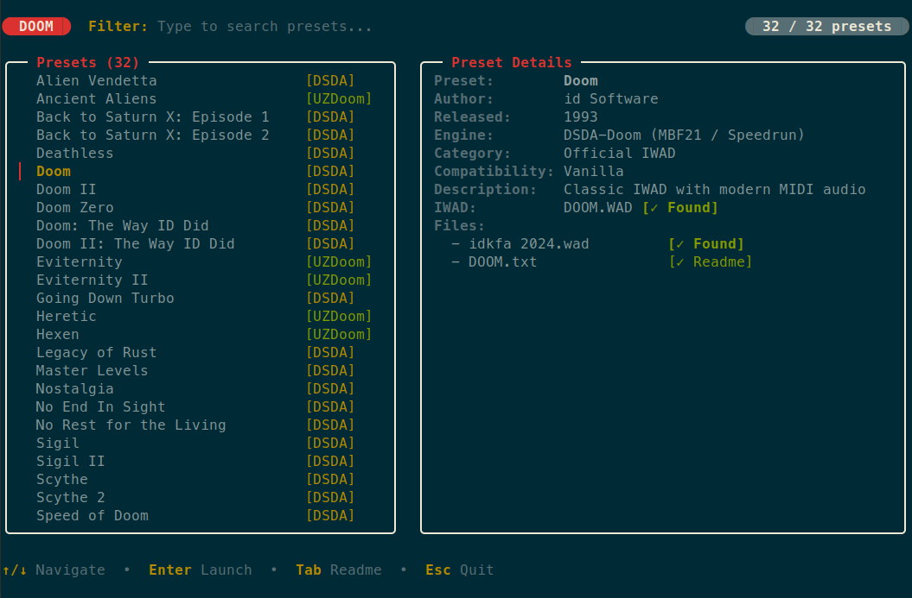
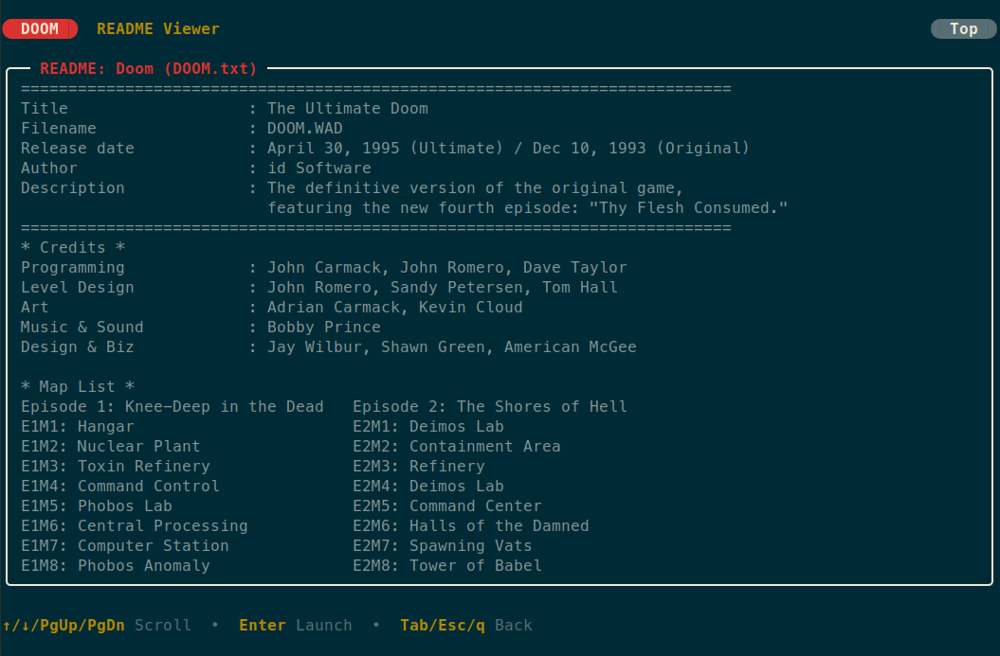

# doom-cli

[](https://go.dev/)
[](https://github.com/lock14/doom-cli/actions/workflows/ci.yml)
[](https://github.com/lock14/doom-cli/actions/workflows/security.yml)


[](LICENSE)

A unified, cross-platform CLI tool and curated collection of configurations and launcher presets for classic Doom source ports (**[DSDA-Doom](https://github.com/kraflab/dsda-doom)** and **[UZDoom](https://github.com/UZDoom/uzdoom)**) across Linux, macOS, and Windows.



---

## Table of Contents

- [Quick Start](#quick-start)
- [Installation](#installation)
  - [Linux & macOS](#linux--macos)
  - [Windows](#windows)
- [Automated Setup (`doom setup`)](#automated-setup-doom-setup)
- [CLI Command Reference](#cli-command-reference)
  - [Core Commands](#core-commands)
  - [Engine Management](#engine-management)
  - [Preset & Custom WAD Management](#preset--custom-wad-management)
  - [WADs & Expansion Management](#wads--expansion-management)
  - [SoundFont Management](#soundfont-management)
  - [Configuration Management](#configuration-management)
  - [Themes & Styling](#themes--styling)
  - [Shell Autocompletion](#shell-autocompletion)
- [Interactive TUI Launcher](#interactive-tui-launcher)
  - [Main Preset Browser Controls](#main-preset-browser-controls)
  - [README Document Viewer Controls](#readme-document-viewer-controls)
- [Themes & Visual Customization](#themes--visual-customization)
  - [Built-in Themes](#built-in-themes)
  - [Custom JSON Themes](#custom-json-themes)
  - [Nerd Fonts & Capsule Badges](#nerd-fonts--capsule-badges)
- [Extensibility](#extensibility)
  - [Add Custom Engines](#add-custom-engines)
  - [Add Custom WADs & Presets](#add-custom-wads--presets)
  - [Configure Per-WAD Launch Options](#configure-per-wad-launch-options)
- [Configuration Schema (`config.json`)](#configuration-schema-configjson)
- [Environment Variables](#environment-variables)
- [Directory Layouts](#directory-layouts)
- [Game Files & Content Setup](#game-files--content-setup)
- [Preconfigured Presets](#preconfigured-presets)
- [Engine Profiles & Customizations](#engine-profiles--customizations)
  - [UZDoom ("Software-Plus" Profile)](#uzdoom-software-plus-profile)
  - [DSDA-Doom (Speedrunning & Demo Accuracy)](#dsda-doom-speedrunning--demo-accuracy)
- [Source Port Packaging (Linux)](#source-port-packaging-linux)
- [Troubleshooting & FAQ](#troubleshooting--faq)
- [Contributing](#contributing)
- [Security](#security)
- [License](#license)

---

## Quick Start

Get from zero to playing classic Doom in three simple commands:

```bash
# 1. Install doom CLI to ~/.local/bin/doom
make install

# 2. Run turnkey setup (downloads engines, configs, soundfont, Steam IWADs & megawads)
doom setup

# 3. Launch the interactive preset browser
doom play
```

---

## Installation

### Linux & macOS

```bash
# Clone the repository
git clone https://github.com/lock14/doom-cli.git
cd doom-cli

# Compile and install the static doom binary to ~/.local/bin/doom
make install
```

*(Alternatively, install directly via Go: `go install github.com/lock14/doom-cli/cmd/doom@latest`)*

> [!TIP]
> Ensure `~/.local/bin` is in your `$PATH` (e.g., in your `~/.bashrc` or `~/.zshrc`):
> ```bash
> export PATH="$HOME/.local/bin:$PATH"
> ```

### Windows

In PowerShell or Windows Terminal:

```powershell
# Clone the repository
git clone https://github.com/lock14/doom-cli.git
cd doom-cli

# Compile doom.exe to your Go bin path
go install ./cmd/doom

# Or compile directly to a dedicated binary folder:
go build -o $HOME/bin/doom.exe ./cmd/doom
```

---

## Automated Setup (`doom setup`)

For players who want everything configured and ready to play in a single step:

```bash
doom setup
```

`doom setup` automatically:
1. **Installs Source Ports**: Downloads portable binaries for UZDoom and DSDA-Doom into your local bin path.
2. **Deploys Engine Configurations**: Installs optimized configs for UZDoom and DSDA-Doom, auto-detecting your display resolution and native monitor refresh rate, while creating timestamped backups (`.bak.<timestamp>`) of any existing files.
3. **Deploys MIDI SoundFont**: Downloads and installs the curated Roland SC-55 SoundFont (`GeneralUser-GS.sf2`) for FluidSynth MIDI playback.
4. **Extracts Official Game Files**: Scans all Steam and GOG library folders across drives for *Doom + Doom II (2024)*, *Heretic*, and *Hexen*, importing commercial IWADs and the modern `idkfa 2024.wad` soundtrack into your WADs directory.
5. **Downloads Community Megawads**: Fetches and extracts all free community megawads (*Eviternity I & II*, *Back to Saturn X 1 & 2*, *Ancient Aliens*, *Sunder*, *Sunlust*, *Sigil I & II*, etc.) and DeHackEd patches from idgames/Doomworld mirrors.

---

## CLI Command Reference

The `doom` CLI provides modular commands for granular management:

### Core Commands

| Command | Description |
| :--- | :--- |
| `doom` / `doom play` | Launches the interactive TUI fuzzy launcher |
| `doom play --once` | Launches the TUI, runs selected preset, and exits without returning to launcher |
| `doom play --theme <name>` | Temporarily runs the TUI with a specific color theme |
| `doom play --nerd-fonts` | Enables Powerlevel10k rounded capsule badges for the session |
| `doom launch <preset> [flags]` | Directly launches a preset by name or prefix with optional engine flags |
| `doom launch <preset> --dry-run` | Prints synthesized launch command without starting the game |
| `doom setup` | Automated turnkey installation of engines, configs, soundfonts, and game files |

### Engine Management

| Command | Description |
| :--- | :--- |
| `doom engines` / `doom engines list` | Lists all configured engines (built-in and custom) with binary status |
| `doom engines add <name> [flags]` | Registers a custom source port engine with binary path and argument style |
| `doom engines remove <name>` | Removes a custom engine from your user configuration |
| `doom engines install` | Downloads and installs portable binaries for `uzdoom` and `dsda-doom` |

### Preset & Custom WAD Management

| Command | Description |
| :--- | :--- |
| `doom presets` / `doom presets list` | Lists all presets (built-in and custom) with engine badges and descriptions |
| `doom presets show <name>` | Displays resolved engine, IWAD, PWADs, and file availability for a preset |
| `doom presets add <name> [flags]` | Registers a custom WAD or mapset preset into your personal library |
| `doom presets config <name> [flags]` | Sets per-WAD launch options (preferred engine, launch flags, custom IWAD) |
| `doom presets config <name> --reset` | Clears custom launch options, reverting back to curated defaults |
| `doom presets remove <name>` | Removes a custom preset from your personal library |
| `doom presets build` | Synchronizes `data/presets.json` into `README.md` (developer tool) |

### WADs & Expansion Management

| Command | Description |
| :--- | :--- |
| `doom wads list` | Lists downloadable community megawads and expected files |
| `doom wads fetch [preset|all]` | Downloads and extracts community megawads from idgames mirrors |
| `doom wads fetch --force` | Re-downloads and overwrites existing WAD files |
| `doom wads extract` | Auto-discovers and imports official Steam and GOG commercial IWADs |
| `doom wads extract --force` | Re-extracts and overwrites existing IWADs in destination |

*(Note: `doom wads extract-steam` is also supported as an alias for `doom wads extract`).*

### SoundFont Management

| Command | Description |
| :--- | :--- |
| `doom soundfont install` | Downloads and deploys Roland SC-55 SoundFont (`GeneralUser-GS.sf2`) |
| `doom soundfont install --force` | Re-downloads and overwrites existing SoundFont |

### Configuration Management

| Command | Description |
| :--- | :--- |
| `doom config show` | Displays active CLI user configuration (`config.json`) |
| `doom config get <key>` | Retrieves a specific configuration value (e.g., `doom config get theme`) |
| `doom config set <key> <val>` | Sets a configuration value (e.g., `doom config set nerd-fonts on`) |
| `doom config toggle <key>` | Toggles a boolean setting (e.g., `doom config toggle nerd-fonts`) |
| `doom config install` | Deploys source port config files with display auto-detection and backups |
| `doom config diff` | Shows diff between repo config templates and live installed configs |
| `doom config sync` | Pulls live tweaks (keybindings, sensitivity) from system back into repo |

### Themes & Styling

| Command | Description |
| :--- | :--- |
| `doom themes` / `doom themes list` | Lists all built-in and custom themes with live ANSI color swatches |
| `doom themes set <theme>` | Sets your default launcher theme in user configuration |

### Shell Autocompletion

Generate shell completion scripts dynamically:

```bash
# Bash
doom completion bash | sudo tee /etc/bash_completion.d/doom > /dev/null

# Zsh
doom completion zsh > "${fpath[1]}/_doom"

# Fish
doom completion fish > ~/.config/fish/completions/doom.fish

# PowerShell
doom completion powershell | Out-String | Invoke-Expression
```

---

## Interactive TUI Launcher

The interactive launcher (`doom play` or `doom`) provides a responsive, split-pane terminal interface powered by Bubble Tea:

- **Fuzzy Search**: Filter across all presets instantly as you type.
- **Side-by-Side Preview Pane**: Displays required IWAD, PWAD file list, DeHackEd patches, and descriptive metadata.
- **File Readiness Indicators**: Displays `✓ Ready` when all required files are present, or `✗ Missing` listing the exact missing files.
- **In-App README Viewer**: Press `Tab` on any preset to read its bundled idgames `.txt` or documentation file in a full-screen scrollable viewport with automatic CP437/DOS box-drawing decoding.
- **Session Memory**: Remembers cursor position across launches when returning to the launcher.

### Main Preset Browser Controls

| Key | Action |
| :--- | :--- |
| `↑` / `k` | Move selection up |
| `↓` / `j` | Move selection down |
| `Enter` | Launch selected preset |
| `Tab` / `Ctrl+R` | Open bundled README / text file in document viewer |
| `t` | Cycle to next color theme |
| `n` | Toggle Nerd Fonts rounded capsule badges |
| `/` | Focus search filter input |
| `Esc` | Clear search filter / return focus to preset list |
| `q` / `Ctrl+C` | Quit launcher |

### README Document Viewer Controls



When viewing a preset's documentation via `Tab`:

| Key | Action |
| :--- | :--- |
| `↑` / `k` | Scroll up one line |
| `↓` / `j` | Scroll down one line |
| `PgUp` / `b` | Scroll up one full page |
| `PgDn` / `f` | Scroll down one full page |
| `Home` / `g` | Jump to beginning of document |
| `End` / `G` | Jump to end of document |
| `Esc` / `q` / `Enter` / `Tab` | Close document viewer and return to preset list |

---

## Themes & Visual Customization

The interactive launcher features a curated semantic color system adhering to the **60-30-10 terminal design principle** (60% canvas neutral, 30% structural framing, 10% focused accent), guaranteeing high contrast and readability across dark and light terminals:

```bash
# List all themes with live terminal color swatches
doom themes list

# Persistently set default theme
doom themes set blood

# Temporarily test a theme for a single run
doom play --theme toxic
```

### Built-in Themes

| Theme | Type | Description |
| :--- | :--- | :--- |
| `classic` | ANSI-16 | Classic Doom Semantic ANSI palette that adapts naturally to your terminal's colors (`default`) |
| `blood` | TrueColor | Gothic Crimson (`#9B111E`) & Bone White Nightdive software-plus aesthetic |
| `toxic` | TrueColor | Radioactive Nukage Green (`#70E000`) & Hazard Amber (`#FFB703`) Phobos techbase aesthetic |
| `inferno` | TrueColor | Volcanic Molten Magma (`#FF5400`) & Charred Basalt Episode 3 aesthetic |
| `frost` | TrueColor | Glacial Cyan (`#56CFE1`) & Midnight Polar Navy Cocytus aesthetic (soothing for nighttime play) |
| `plasma` | TrueColor | Plasma Rifle electric cyan (`#05D9E8`) & hot neon pink (`#FF2A6D`) |
| `heretic` | TrueColor | Raven Software dark fantasy mystic amethyst (`#BD93F9`) & elven emerald (`#50FA7B`) |
| `amber` | TrueColor | Vintage 1980s DEC VT220 / Hercules warm amber phosphor CRT monitor (`#FFB000`) |
| `sigil` | TrueColor | Romero occult velvet maroon (`#5E0B15`) & pentagram red (`#D90429`) |
| `monochrome` | ANSI | High-contrast Black & White for minimalists or monochrome terminals |

### Custom JSON Themes

Create custom themes in `<config_dir>/themes/<theme_name>.json` (e.g., `~/.config/doom-cli/themes/solarized.json`):

```json
{
  "name": "solarized",
  "type": "dark",
  "description": "Solarized dark palette",
  "brand_fg": "#FFFFFF",
  "brand_bg": "#CB4B16",
  "accent_primary": "#268BD2",
  "accent_secondary": "#2AA198",
  "text_primary": "#93A1A1",
  "text_muted": "#586E75",
  "border": "#073642",
  "border_focus": "#268BD2",
  "cursor_fg": "#002B36",
  "cursor_bg": "#268BD2",
  "tag_uzdoom_fg": "#B58900",
  "tag_uzdoom_bg": "#073642",
  "tag_dsda_fg": "#859900",
  "tag_dsda_bg": "#073642",
  "status_ok": "#859900",
  "status_missing": "#DC322F"
}
```

Theme resolution follows standard precedence:
1. `--theme <name>` CLI flag
2. `DOOM_THEME` environment variable
3. `theme` setting in user configuration (`config.json`)
4. `default` built-in theme

### Nerd Fonts & Capsule Badges

By default, the launcher uses universal rectangular badges (` DOOM `) and standard text prompts (`Filter: `), guaranteeing clean rendering in 100% of standard terminal emulators without requiring patched fonts.

If your terminal font includes Nerd Font glyphs (e.g., JetBrains Mono NF, MesloLGS NF, FiraCode NF), you can enable Powerlevel10k-style rounded capsule badges (` DOOM `):

```bash
# Enable temporarily for one session
doom play --nerd-fonts

# Permanently toggle in user configuration
doom config toggle nerd-fonts
doom config set nerd-fonts on
```

---

## Extensibility

`doom-cli` is fully extensible while keeping curated defaults as the baseline foundation:

### Add Custom Engines

Register any source port installed on your system (e.g., Woof!, Crispy Doom, GZDoom, PrBoom+):

```bash
# Add Woof! source port (Boom argument style with -file and -deh)
doom engines add woof --bin woof --args-style boom --desc "Woof! MBF21 port"

# Add GZDoom pointing to an explicit binary path
doom engines add gzdoom --bin /usr/bin/gzdoom --args-style zdoom --desc "GZDoom OpenGL/Vulkan"

# List all available engines and verify binary availability
doom engines list
```

### Add Custom WADs & Presets

Add custom mapsets or community mods to your library. They automatically integrate into `doom play` fuzzy search and direct execution (`doom launch`):

```bash
# Add a custom mapset with required IWAD and PWADs
doom presets add "KDiZD" --engine uzdoom --iwad DOOM.WAD --files "kdizd_12.pk3" --desc "Knee-Deep in ZDoom"

# Inspect preset details and missing file status
doom presets show "KDiZD"

# Launch your custom preset
doom launch "KDiZD"
```

### Configure Per-WAD Launch Options

Customize launch preferences for any WAD without modifying repository defaults:

```bash
# Always launch Sunlust in Woof! with ultra-violence skill
doom presets config "Sunlust" --engine woof --args "-skill 4"

# Set Ancient Aliens to always run with Boom complevel 11
doom presets config "Ancient Aliens" --args "-complevel 11"

# Reset custom launch options back to curated defaults
doom presets config "Sunlust" --reset
```

---

## Configuration Schema (`config.json`)

User configurations are persisted in `~/.config/doom-cli/config.json` (Linux), `~/Library/Application Support/doom-cli/config.json` (macOS), or `%LOCALAPPDATA%\doom-cli\config.json` (Windows):

```json
{
  "theme": "blood",
  "nerd_fonts": false,
  "engines": {
    "woof": {
      "name": "woof",
      "binary": "woof",
      "family": "boom",
      "args_style": "boom",
      "description": "Woof! MBF21 port"
    }
  },
  "presets": [
    {
      "name": "KDiZD",
      "engine": "uzdoom",
      "iwad": "DOOM.WAD",
      "mappacks": [
        "kdizd_12.pk3"
      ],
      "description": "Knee-Deep in ZDoom"
    }
  ],
  "launch_options": {
    "Sunlust": {
      "engine": "woof",
      "additional_args": "-skill 4"
    }
  }
}
```

---

## Environment Variables

The `doom` CLI respects the following environment variables:

| Variable | Description | Default |
| :--- | :--- | :--- |
| `DOOM_THEME` | Color theme for the interactive launcher | `default` (or value in `config.json`) |
| `DOOM_WADS_DIR` | Directory containing game IWADs, PWADs, and DeHackEd patches | Platform standard WAD directory |
| `DOOM_BIN_DIR` | Directory containing source port engine binaries | Platform standard binary directory |
| `DOOM_PRESETS_FILE` | Custom path to external presets JSON file | Embedded `data/presets.json` |

---

## Directory Layouts

The `doom` CLI automatically respects standard, platform-idiomatic paths:

| Component | Linux (XDG) | macOS | Windows |
| :--- | :--- | :--- | :--- |
| **Binaries** | `~/.local/bin/` | `~/.local/bin/` | `%LOCALAPPDATA%\Programs\Doom\bin\` |
| **WADs & Mods** | `~/.local/share/games/uzdoom/` | `~/Library/Application Support/games/uzdoom/` | `<Drive>:\Doom WADS\` (or `%LOCALAPPDATA%\Doom WADS\`) |
| **UZDoom Config** | `~/.config/uzdoom/autoexec.cfg` | `~/Library/Application Support/uzdoom/autoexec.cfg` | `%APPDATA%\uzdoom\autoexec.cfg` |
| **DSDA-Doom Config** | `~/.local/share/dsda-doom/dsda-doom.cfg` | `~/Library/Application Support/dsda-doom/dsda-doom.cfg` | `%LOCALAPPDATA%\dsda-doom\dsda-doom.cfg` |
| **CLI Config & Themes** | `~/.config/doom-cli/` | `~/Library/Application Support/doom-cli/` | `%LOCALAPPDATA%\doom-cli\` |
| **SoundFonts** | `~/.local/share/soundfonts/` | `~/Library/Application Support/soundfonts/` | `%LOCALAPPDATA%\soundfonts\` |

---

## Game Files & Content Setup

> [!IMPORTANT]
> **Commercial Game Files Are Not Tracked in Git**
> 
> This repository contains configuration files, launcher presets, and automated fetch tools. You must provide your own legally acquired game files:
> - **Commercial IWADs** (`DOOM.WAD`, `DOOM2.WAD`, `PLUTONIA.WAD`, `TNT.WAD`, `HERETIC.WAD`, `HEXEN.WAD`) can be acquired from digital storefronts:
>   - **Doom + Doom II**: [Steam](https://store.steampowered.com/app/2280/DOOM_DOOM_II/) / [GOG](https://www.gog.com/en/game/doom_doom_ii)
>   - **Heretic + Hexen**: [Steam](https://store.steampowered.com/app/3286930/Heretic__Hexen/) / [GOG](https://www.gog.com/en/game/heretic_hexen)
>   *(Tip: Run `doom wads extract` to auto-discover and import them directly from your Steam/GOG libraries).*
> - **Community Megawads & Expansions** (*Ancient Aliens*, *Eviternity I & II*, *Back to Saturn X*, *Sunlust*, *Sunder*, etc.) can be fetched automatically via `doom wads fetch` or downloaded from **[Doomworld / idgames](https://www.doomworld.com/idgames/)**.

---

## Preconfigured Presets

All presets are declaratively managed in [`data/presets.json`](data/presets.json) and mapped to their optimal engine:

| Megawad / Expansion | Engine | Compatibility / Details |
| :--- | :--- | :--- |
| **Alien Vendetta** | DSDA-Doom | Classic Boom megawad + DEH patch |
| **Ancient Aliens** | UZDoom | MBF / Complevel 11 with custom color palette |
| **Back to Saturn X: Episode 1** | DSDA-Doom | Vanilla/Boom compatible with custom soundtrack & palettes |
| **Back to Saturn X: Episode 2** | DSDA-Doom | Vanilla/Boom compatible with custom soundtrack & palettes |
| **Deathless** | DSDA-Doom | Modern Ultimate Doom episode replacement |
| **Doom** | DSDA-Doom | Classic IWAD with modern MIDI audio |
| **Doom II** | DSDA-Doom | Classic IWAD with modern MIDI audio |
| **Doom Zero** | DSDA-Doom | Anniversary megawad + DEH modifications |
| **Doom: The Way ID Did** | DSDA-Doom | Classic vanilla-style homage megawad |
| **Doom II: The Way ID Did** | DSDA-Doom | Classic vanilla-style homage megawad |
| **Eviternity** | UZDoom | OTEX texture pack & custom monsters |
| **Eviternity II** | UZDoom | OTEX texture pack, advanced MBF21 & custom monsters |
| **Going Down Turbo** | DSDA-Doom | Fast-paced, compact map pack |
| **Heretic** | UZDoom | Raven Software classic fantasy shooter |
| **Hexen** | UZDoom | Raven Software hub-based fantasy shooter |
| **Legacy of Rust** | DSDA-Doom | Official ID24 standard episode + weapons & monsters |
| **Master Levels** | DSDA-Doom | Full 20-level classic collection |
| **Nostalgia** | DSDA-Doom | Vanilla-compatible megawad |
| **No End In Sight** | DSDA-Doom | Classic 4-episode expansion for Ultimate Doom |
| **No Rest for the Living** | DSDA-Doom | Official 9-level expansion for Doom II |
| **Sigil** | DSDA-Doom | John Romero's unofficial 5th episode for Ultimate Doom |
| **Sigil II** | DSDA-Doom | John Romero's unofficial 6th episode for Ultimate Doom |
| **Scythe** | DSDA-Doom | Iconic fast-paced speedrunning megawad |
| **Scythe 2** | DSDA-Doom | Erik Alm's legendary sequel with custom monsters |
| **Speed of Doom** | DSDA-Doom | 33-level intense challenge megawad |
| **Sunder** | DSDA-Doom | Monumental architectural slaughter megawad |
| **Sunlust** | DSDA-Doom | 32-level visual and gameplay masterpiece |
| **The Plutonia Experiment** | DSDA-Doom | Classic Final Doom IWAD with modern soundtrack |
| **Plutonia 2** | DSDA-Doom | Community sequel to The Plutonia Experiment |
| **TNT: Evilution** | DSDA-Doom | Classic Final Doom IWAD with modern soundtrack |
| **TNT: Revilution** | DSDA-Doom | Community sequel to TNT: Evilution |
| **Valiant** | UZDoom | MBF-compatible with custom weapons & dehacked |

---

## Engine Profiles & Customizations

### UZDoom ("Software-Plus" Profile)

Configured in [`uzdoom/autoexec.cfg`](uzdoom/autoexec.cfg) to reproduce the crisp Nightdive Remaster aesthetic:
- **Software Sector Lighting**: `gl_lightmode 0` with light stepping (`gl_bandedsw 1`).
- **Tonemapping**: 256-color palette tonemapping (`gl_tonemap 3`).
- **Nearest-Neighbor Filtering**: Crisp, unblurred pixels (`gl_texture_filter 0`) with 16x anisotropic filtering (`gl_texture_filter_aniso 16`).
- **Remaster HUD & Crosshair**: Minimalist widescreen alternate HUD and classic Nightdive green crosshair (`#00FF00`).
- **Quality of Life**: High-definition 48kHz audio sampling, FluidSynth MIDI backend, and `F5`/`F9` fast save & load.

### DSDA-Doom (Speedrunning & Demo Accuracy)

Configured in [`dsda-doom/dsda-doom.cfg`](dsda-doom/dsda-doom.cfg):
- **Compatibility**: Default `complevel 21` (MBF21 standard).
- **Video & Display**: OpenGL mode with integer scaling, VSync frame pacing, and uncapped high-refresh support (no artificial 60 FPS cap).
- **Extended HUD (exHUD)**: In-game level splits, secret counters, and completion times.
- **Built-in Capture**: Ready-to-use `ffmpeg` video recording commands.

---

## Source Port Packaging (Linux)

When running Doom source ports on Linux, standalone native binaries or AppImages in `~/.local/bin/` are strongly recommended over sandboxed Flatpaks. 

Flatpaks isolate applications from the rest of the filesystem, preventing the launcher (`doom play`) from discovering game engines or accessing WADs across custom paths without manual permission overrides. Running `doom setup` or `doom engines install` automatically manages standalone binaries in your user path.

---

## Troubleshooting & FAQ

### 1. "Base IWAD not found" error when launching
Ensure commercial IWADs (`DOOM2.WAD`, `DOOM.WAD`, etc.) are in your WAD directory (`~/.local/share/games/uzdoom/` on Linux). If you own the game on Steam or GOG, run:
```bash
doom wads extract
```
Or specify a custom WAD directory with `--wads-dir <path>` or `export DOOM_WADS_DIR=<path>`.

### 2. "Engine binary not found in PATH"
Run `doom engines install` to download portable binaries for UZDoom and DSDA-Doom into `~/.local/bin/`, or verify `~/.local/bin` is in your `$PATH`. You can also configure a custom engine with an absolute binary path using `doom engines add <name> --bin /path/to/binary`.

### 3. MIDI music is silent or failing to initialize
Verify FluidSynth SoundFont deployment:
```bash
doom soundfont install
```
Ensure `GeneralUser-GS.sf2` is present in `~/.local/share/soundfonts/`.

### 4. Display resolution or refresh rate mismatch
When switching monitors, re-detect native display resolution and refresh rate by running:
```bash
doom config install
```
This automatically updates `screen_resolution` in `dsda-doom.cfg` and `vid_maxfps` in `autoexec.cfg` while creating timestamped backups of your prior configurations.

---

## Contributing

We welcome contributions! Please review our [Contributing Guidelines](CONTRIBUTING.md) for architecture details, development setup, code style, and pull request verification instructions.

---

## Security

Please report security issues responsibly according to our [Security Policy](SECURITY.md).

---

## License

Apache 2.0. See [LICENSE](LICENSE).
